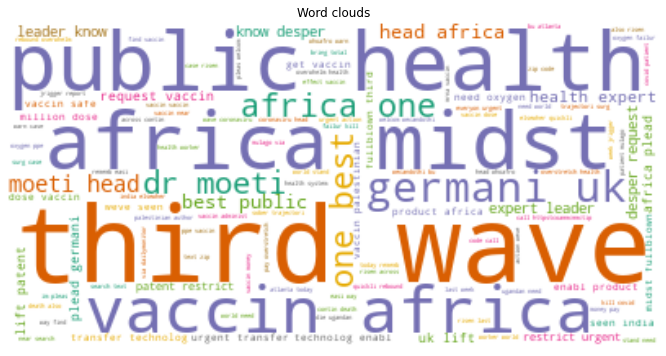
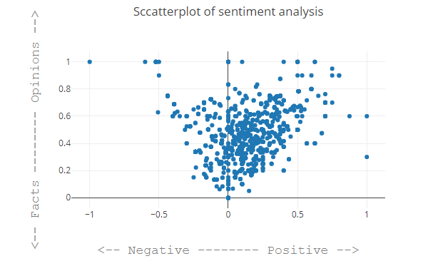

# About

This project aims to analyze people's sentiments on COVID-19 data collected in Africa
via twitter using the keywords [‘COVID19 Africa’, ‘COVID19 Vaccination Africa’, ‘Sars-Cov2 Mutation Africa’] and figuring out whether or not the tweet has positive, negative or neutral sentiment. 

Different preprocessing tasks are done on the twitter data and a classification model is
built to categorize between the three classes of sentiments available. Understanding the
different sentiments that exist in tweets about COVID-19 here in Africa is an essential task in
identifying and implementing preventive or proactive measures in the times to come. The built
model currently achieves an accuracy of 70% and further optimization and hyperparameter
tuning techniques will be employed to attain a better classification model.

# Data

Data used in this project is collected using the Tweepy library, a Python library for accessing the Twitter API. The data is around 100mb of a raw twitter data dumb in JSON format. This data is collected using the following keywords: [‘COVID19 Africa’, ‘COVID19 Vaccination Africa’, ‘Sars-Cov2 Mutation Africa’]. Already fetched data is provided [here](https://github.com/10xac/Twitter-Data-Analysis) by 10 Academy.

*Fig 1.0 classes existing in the polarity feature of our data*

# Method

Method used in this project is the CRISP-DM standard, a cross-industry standard process for data mining. The CRISP-DM methodology provides a structured approach to planning our sentiment analysis project.

 **Fig 2.0 CRISP-DM swim-lane of Africa's covid twitter sentiment analysis projec*t*

---

# Result and conclusion

After thorough cleaning and stemming it was seen that this specific data had tweets with words which were repeated again and again. To visualize the most occuring words we've used wordclouds like below.

*Fig 3.0 WordCloud of the most frequent words in our tweets dataset*

This wordcloud shows us that a third wave might be coming in Africa, people tweet about it being a public health crisis and a lot about vaccine and Dr moeti.

Further analysis that can be done is a scatterplot of the sentiment of the tweet(provided to us by the TextBlob library) The textblob library returns to us the polarity(how positive or negative a tweet is)  and sensitivity(how much of a bias) there is in the tweet.

---

